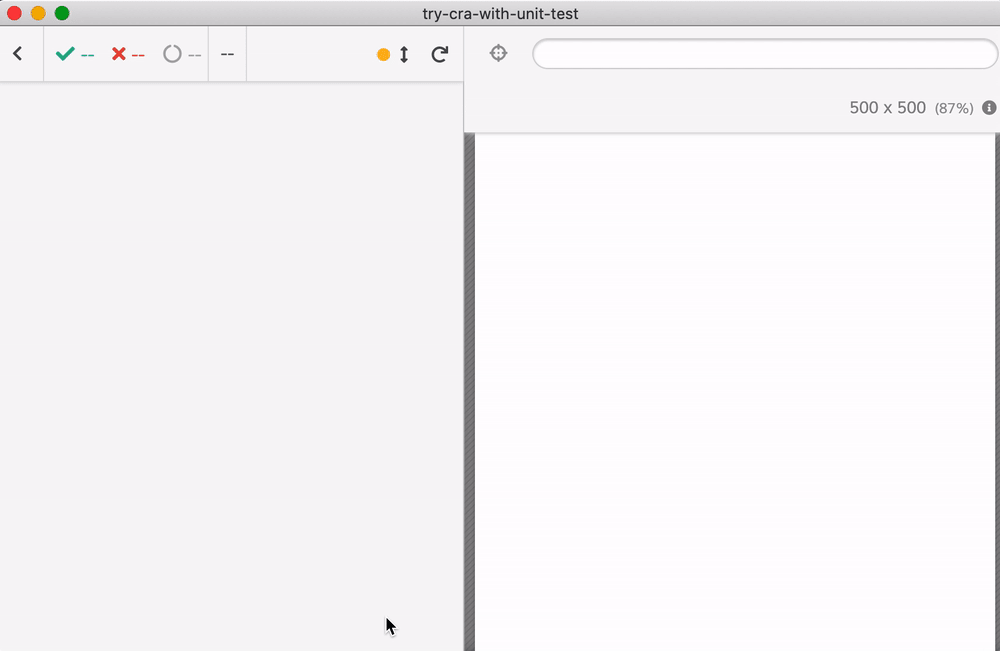

# try-cra-with-unit-test

 

This project was bootstrapped with [Create React App](https://github.com/facebook/create-react-app) and can be tested using [Cypress](https://www.cypress.io) and [cypress-react-unit-test](https://github.com/bahmutov/cypress-react-unit-test)

```shell
$ yarn
$ yarn cypress open
```

Select `App.cy-spec.js` to run component test [src/App.cy-spec.js](src/App.cy-spec.js)



Dynamically created resources like that SVG are not served by Cypress yet.

Check [cypress.json](cypress.json)

Read [My Vision for Component Tests in Cypress](https://glebbahmutov.com/blog/my-vision-for-component-tests/)
